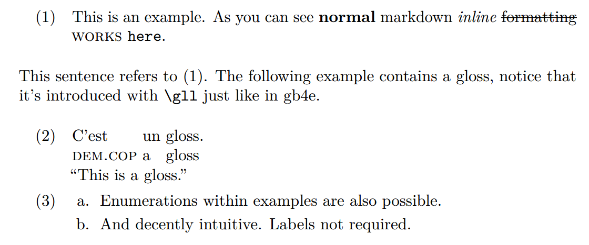

# pangb4e

Linguists who use LaTeX enjoy a number of packages for numbered examples and interlinear glossing. This support is unfortunately missing from markdown with [Pandoc](https://pandoc.org/index.html), despite using LaTeX to render pdfs.

Pangb4e is a [lua filter](https://pandoc.org/lua-filters.html) for Pandoc that provides numbered example and glossing support for markdown to LaTeX/pdf conversion using [gb4e](https://ctan.org/pkg/gb4e?lang=en).

The syntax modifies the existing numbered example syntax in pandoc using familiar notions from gb4e (`\gll` tag introduces a gloss.), and supports labeling and referencing examples.

Here's are three quick examples.

    (@) {#example1} This is an example. As you can see **normal** markdown *inline* ~~formatting~~ [works]{.smallcaps} `here`.

    This sentence refers to <#example1>. The following example contains a gloss, notice that it's introduced with `\gll` just like in gb4e.

    (@) {#example2}
        \gll C'est un gloss.
         [dem.cop]{.smallcaps} a gloss
         "This is a gloss."

    (@) {#example3}
        1. {#example3sub1} Enumerations within examples are also possible.

        2. And decently intuitive. Labels not required.

These render as:

A full example is provided in example.md/.pdf.

Contributions are welcome. A previous version of this filter had HTML support, so I'm working on porting it to this one also.

# Requirements and usage

gb4e must be installed and accessible by the latex compiler of choice. It must also be either included in your latex template or included in your latex header using Pandoc's metadata functionality somehow, as in the following yaml header (see example.md):

    ---
    header-includes: |
        \usepackage{gb4e}
    ---

Just call the filter like this:

    pandoc -o document.pdf --lua-filter pangb4e.lua document.md

# A note

Those familiar with Pandoc's markdown might be confused: "Doesn't Pandoc already support numbered examples?" In fact, it does, and the syntax here cribs from the native numbered example syntax. However, Pandoc's native number example support, 1) does not support interlinear glosses, and 2) doesn't support sub-examples with references. Rebuilding numbered examples with gb4e syntax solves both of these problems.

Also, as the numbered example support works in Pandoc 2.9.2.1, native label support for numbered examples does not make labels accessible in Pandoc's AST. This means that filters can't retrieve "example1" from `(@example1)`.
